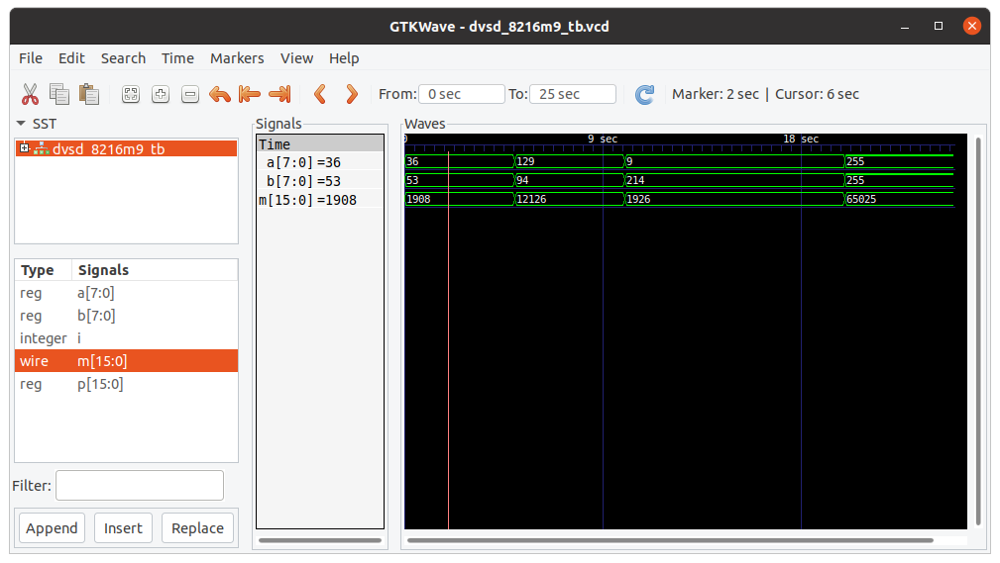
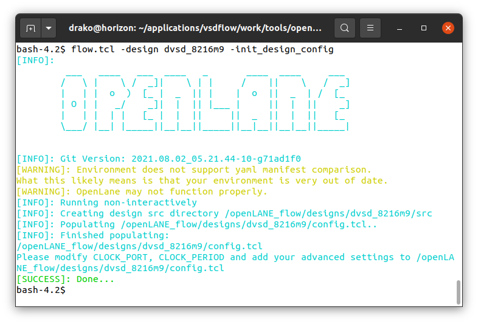
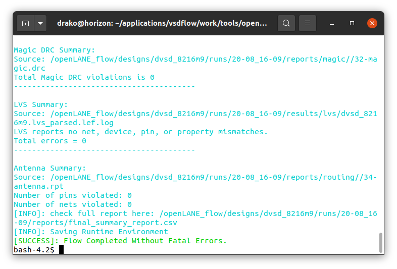
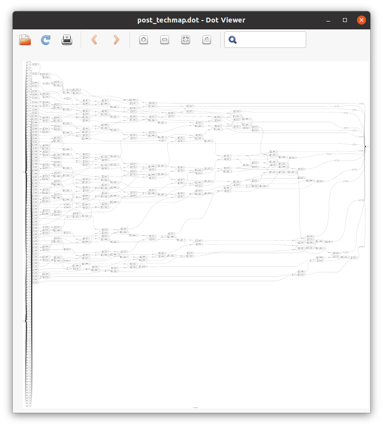
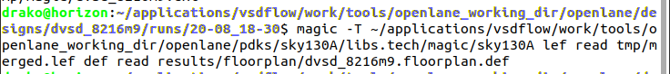
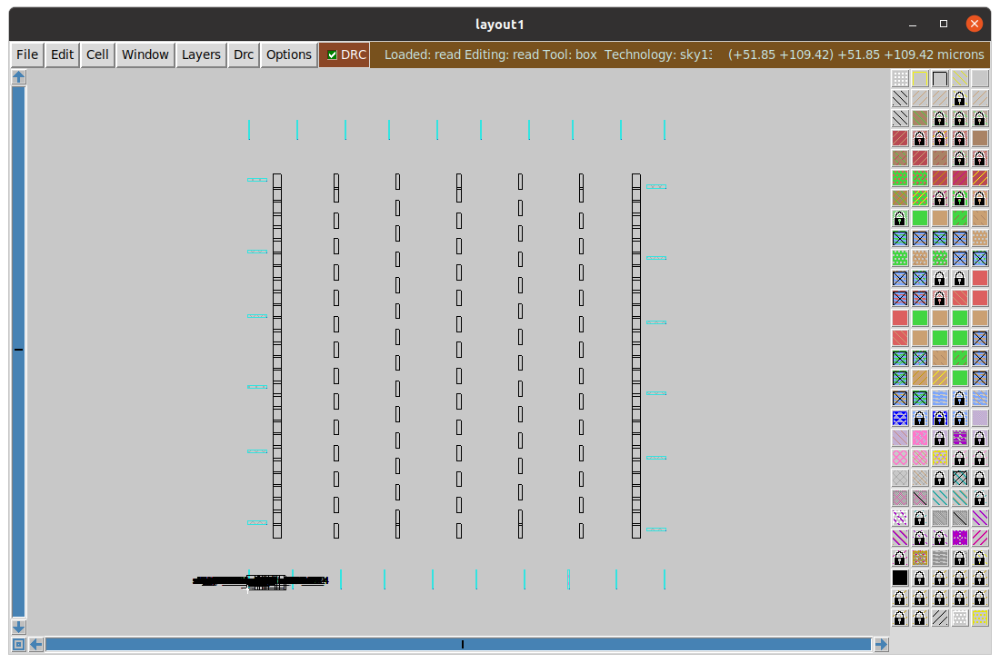
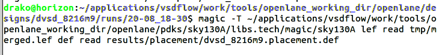
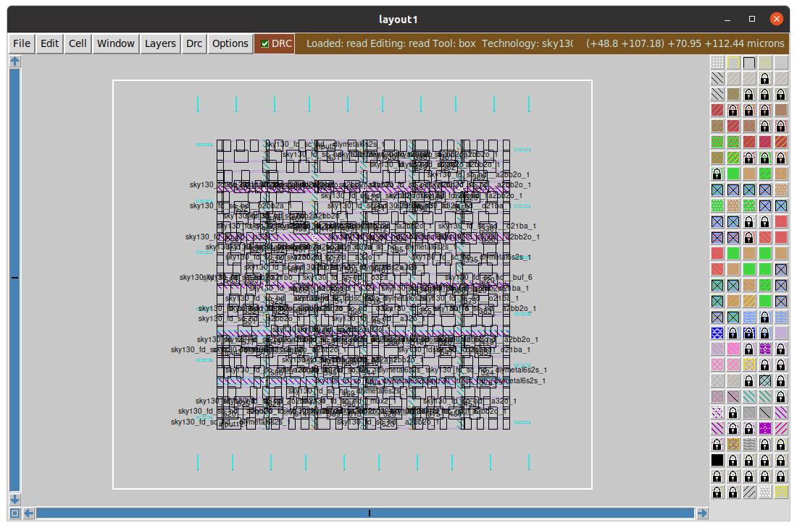
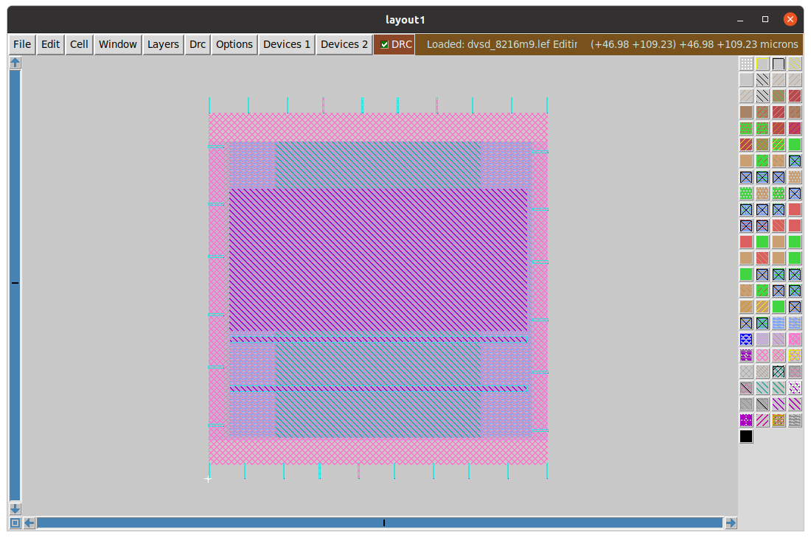

# 8 bit binary Multiplier using sky130 PDK with OpenLane

**Contents:**

<!-- @import "[TOC]" {cmd="toc" depthFrom=1 depthTo=6 orderedList=false} -->

<!-- code_chunk_output -->

- [8 bit binary Multiplier using sky130 PDK with OpenLane](#8-bit-binary-multiplier-using-sky130-pdk-with-openlane)
  - [1. Verification of the Muliplier](#1-verification-of-the-muliplier)
    - [1.1. Design Verification](#11-design-verification)
  - [2. OpenLane Flow](#2-openlane-flow)
    - [2.1. Preparation](#21-preparation)
    - [2.2. Synthesis](#22-synthesis)
    - [2.3. Floor Planning](#23-floor-planning)
    - [2.4. Placement](#24-placement)
  - [References:](#references)
  - [Acknowledgements:](#acknowledgements)

<!-- /code_chunk_output -->

---

The binary multiplier uses two 8-bit inputs(A and B) to produce 16-bit output. You can use the make file commads to reproduce this project. To check available commads run `make help` inside `sim` directory.

## 1. Verification of the Muliplier 

To verify the rtl code

```
make test9
```

```
time	| A			| B			| M				 
0		| 0010 0100	| 0011 0101	| 0000 0111 0111
5		| 1000 0001	| 0101 1110	| 0010 1111 0101
10		| 0000 1001	| 1101 0110	| 0000 0111 1000
20		| 1111 1111	| 1111 1111	| 1111 1110 0000
```

### 1.1. Design Verification

Design is verified with GTKwave




## 2. OpenLane Flow

### 2.1. Preparation 

Start the OpenLane workflow within a docker container. Adding the project to the designs folder. Then lets open the design with openlane

```
flow.tcl -design dvsd_8216m9 -init_design_config
```




To run the design with openlane

```
flow.tcl -design dvsd_8216m9
```

### 2.2. Synthesis



Viewing the syntheiszed rtl code with yosys.

```
xdot tmp/synthesis/hierarchy.dot
xdot tmp/synthesis/post_techmap.dot
```





### 2.3. Floor Planning 

To run floor planning in openlane

```sh
run_floorplanning

magic -T $PDK_ROOT/sky130A/libs.tech/magic/sky130A lef read tmp/merged.lef def read results/floorplan/dvsd_8216m9.floorplan.def
```





### 2.4. Placement 

To run placement 

```sh
run_placement
```
To view placement 







Converting to spice


## References:

* https://github.com/efabless/openlane
* [The-OpenROAD-Project](https://github.com/The-OpenROAD-Project/)
* [openlane-workshop](https://gitlab.com/gab13c/openlane-workshop#about-the-project)
* [Magic VLSI](http://opencircuitdesign.com/magic/)


## Acknowledgements:

* [Kunal Ghosh](https://github.com/kunalg123), Co-founder, VSD Corp. Pvt. Ltd.